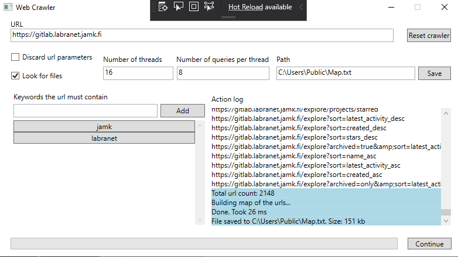



# Koolaid is a WPF-based web crawler written in C-Sharp.

## 

##   Features

	Web crawlers, also known as spiders, are most often used by search engines such as Google, Bing DuckDuckGo, 
	to go through web pages and read the content on them. Web crawlers work by giving them an initial address to 
	start from and from there it will find new addresses to browse through. Web crawlers benefit a lot from concurrency,
	since usually the highest amount of time is spent loading the page. By using some concurrent method such as using multiple 
	threads to load and read through the pages, performance of the crawler can be substantially increased..

##   System requirements

- You need [VC++ 2019 Runtime](https://aka.ms/vs/17/release/vc_redist.x64.exe) 32-bit and 64-bit versions

- You will need .NET 8.

- You need to install the version of VC++ Runtime that Baby Browser needs. 
## Implementation

I implemented the solution by creating a class named ``Crawler``.
The class packs inside itself 
* ``HttpClient`` to make requests
* ``ConcurrentQueue`` to hold urls to visit next
* ``HashSet`` for keeping track of all visited urls and urls found. 
* ``Semaphore`` for protecting variables from data races
* ``List`` of tasks that do all the work
* ``SiteMap`` (my own implementation) that holds recursive data structure to map out the web pages 

	Crawler is started by calling Run method, which creates desired amount of Tasks.
	``CancellationToken`` is also passed in case the user wants to stop the execution. Each task will start by dequeing an 
	url from the queue. If the queue is empty, task will try dequeing item until it will timeout (5 sec)
	or it will dequeue url succesfully. Queue uses ConcurrentQueue class so it is thread safe.
	Url is then used to create a http request. First status code is checked to be ok and then the header content is checked to be text/html.
	If this is ok, page is loaded and passed to helper function which finds all urls by looking for strings in the html which start with ``href="`` and end with ``"``.

	These links are then added to a HashSet which is basically an unordered list. I will call it a list for now the keep things simple. 
	Elements in this list are then added to a list which contains all urls, if it is not already in it, and it will also get added to 
	queue if the url has not been yet visited and is not invalid file type such as .exe or .jpeg.
	After parsing the urls from the body of html, the current url is added to a list which holds all visited urls.
	After that, new url is dequeued and same process is repeated.

##  Documentation

- [User Guide](Resources/Github/Users.md) - How to get Koolaid
- [Compilation Guide](Resources/Github/Compilation.md) - How to compile koolaid.
- [Configuration Guide](Resources/Github/Configuration.md) - Configuration settings used in koolaid.
- [Distribution Guide](Resources/Github/Distribution.md) - Create a new installer package

##  Code

- Built on NET 8
- Supports AnyCPU as well as x86/x64 specific builds
- [Crawler](https://github.com/is-leeroy-jenkins/Koolaid/blob/master/Data/Crawler.cs) - the web crawler class.
- [UI](https://github.com/is-leeroy-jenkins/Koolaid/blob/master/UI) - main UI layer and associated controls and related functionality.
- [Assets](https://github.com/is-leeroy-jenkins/Koolaid/tree/master/Resources/Assets) - resources used in koolaid.

## [Report](./REPORT.md)

## [Example output](./Map.txt)

